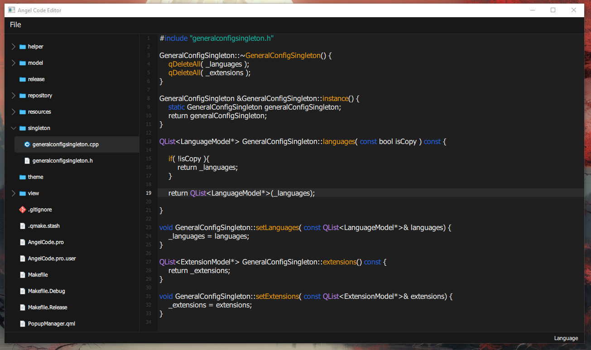
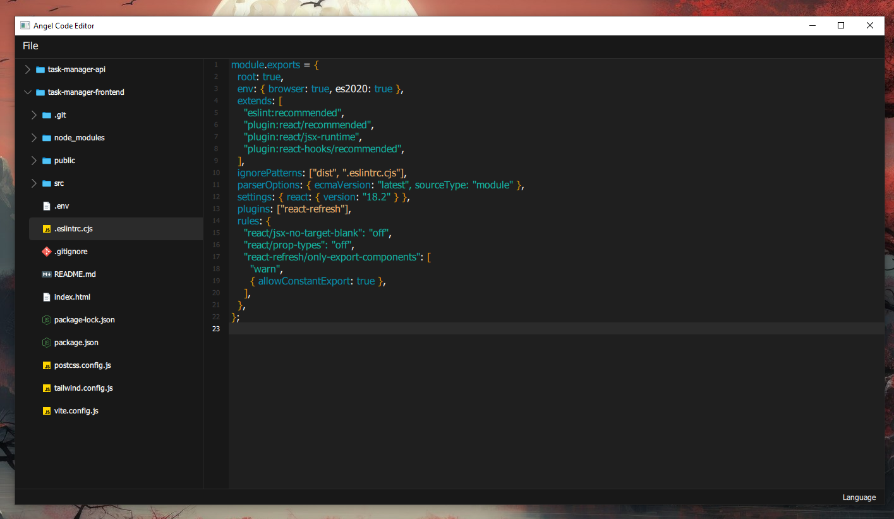
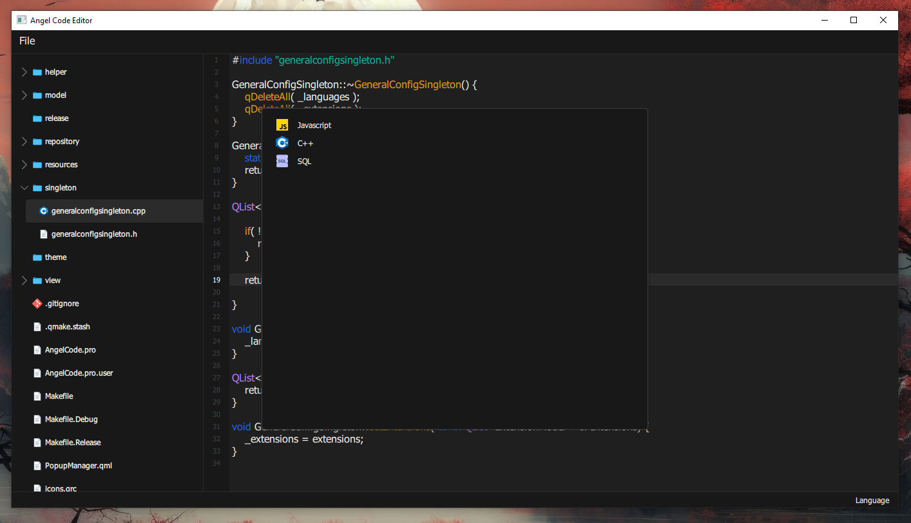
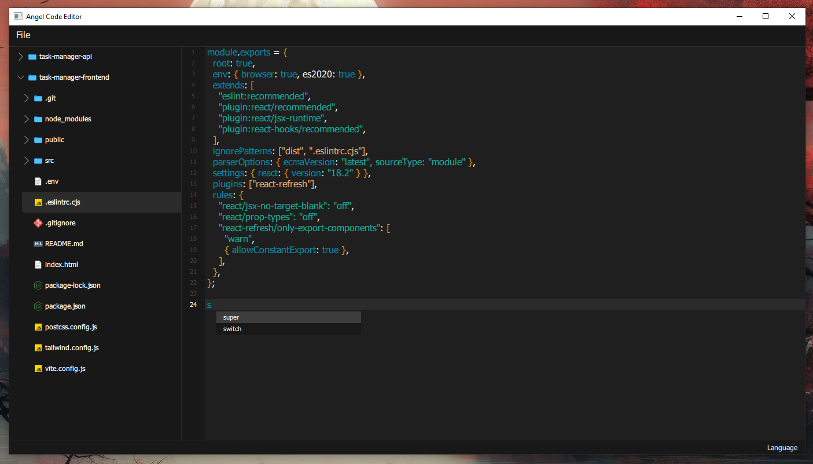
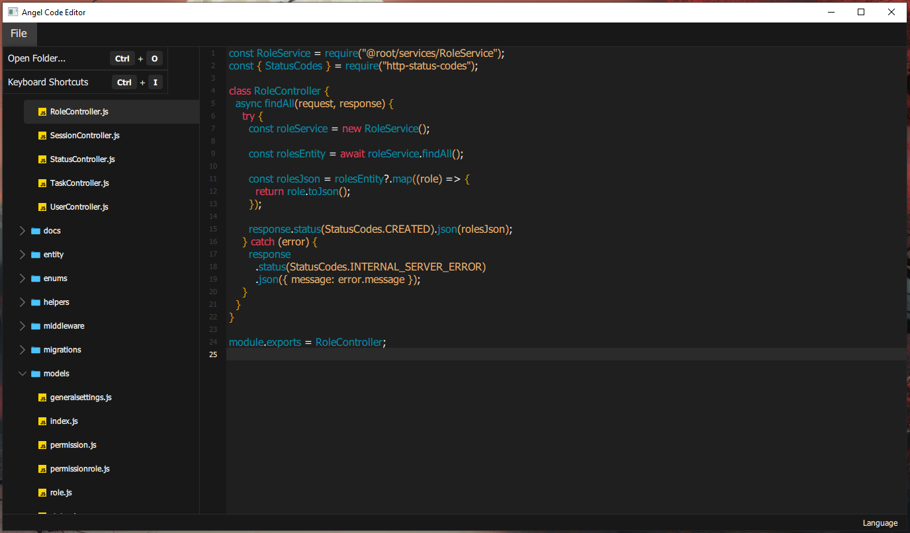
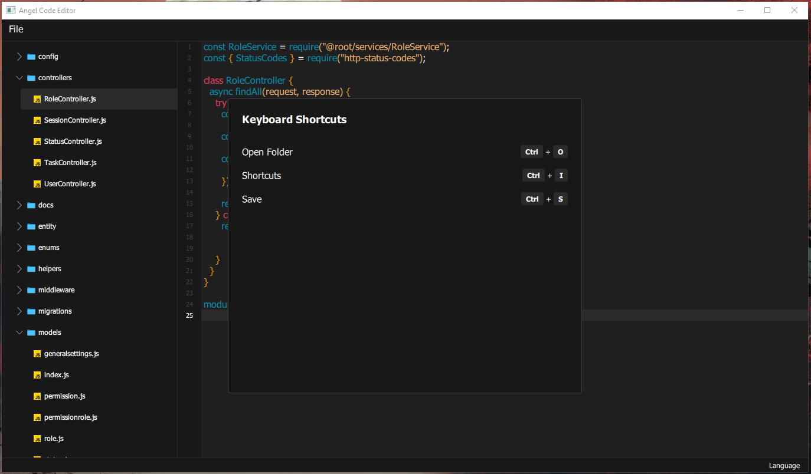

## Angel Code Editor

- A simple code editor with C++ and QML using QT Framework.
- The goal is to be a code editor that allows you to add style rules, formatting, complete text, and more. Being dynamic and customizable.

## Features
- Syntax highlighting ( Basic operation for now ) 
- Text Completer ( Basic operation for now )
- Open Folder / Edit and save file

## Languages
- c++
- SQL
- Javascript

## Images 

